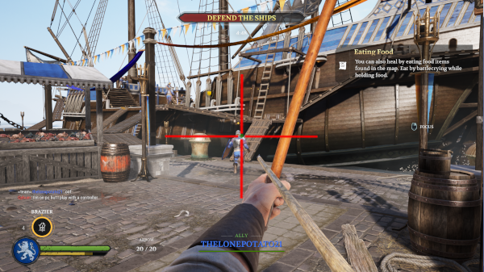
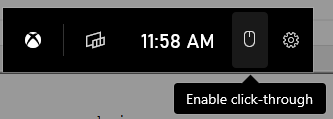
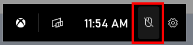
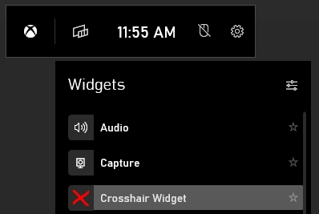
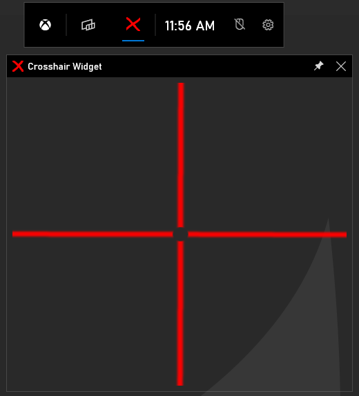

# Uwp_Crosshair

This is an Xbox Game Bar project that has a widget with transparency to show a crosshair.

## Releases

* [Windows Installer](https://github.com/tgraupmann/Uwp_Crosshair/releases/tag/1.0.0) - Xbox Game Bar Crosshair Widget

## Setup

* Open Xbox Game Bar by pressing the `Windows Key` and `G` on the keyboard

* Enable `click-through` on menu bar

* The same toggle can be used to disable `click-through`

* Open the `Crosshair Widget` from the widget menu

* Pin the `Crosshair Widget` so that it appears when the `Xbox Game Bar` overlay is dismissed

* Reopen the `Xbox Game Bar` overlay to position and size the crosshair in the optimal place

# Support

Support is available in Discord, you can reach me at `Tim Graupmann#0611`.
